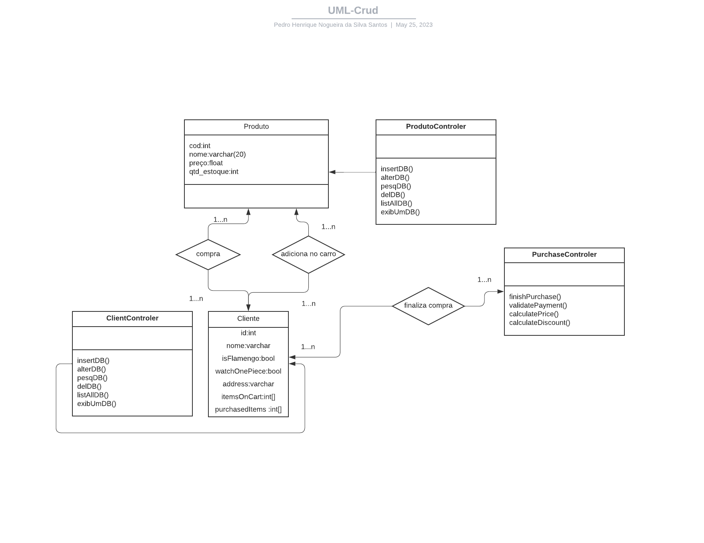

# Projeto de banco de dados - 2022.2 - UFPB

## Integrantes:

- Pedro Henrique Nogueira da Silva Santos
- Diego Luis Reis da Silva

## Tecnolgias:

- PostgresSQL
- Node.js
    - node-postgres(pg): npm install pg
    - file-system(fs)
    - knex: npm install knex

> Configurações do banco de dados:

- Cria banco de dados: Crud_base / ou utilizar o arquivo db.js -> node ./database/db.js

- Schema -> Table -> Table criada: produtos;

- Variáveis: cod = integer, Not Null, Primary Key; nome = character, 20, Not Null; preço = numeric(3,2); quatidade = integer;

- Constraints: pk_prod -> cod

- Executar: node index.js

### Diagrama UML:

